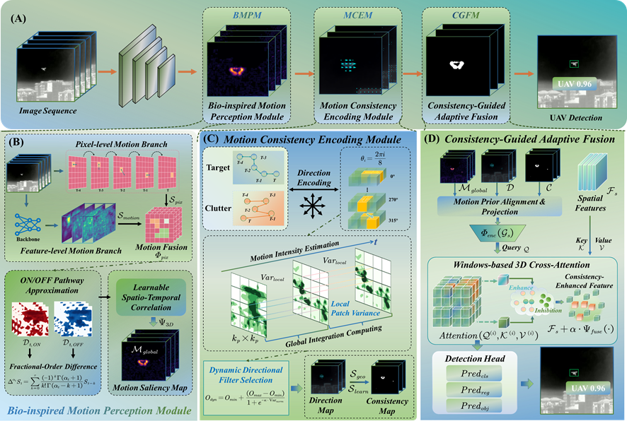
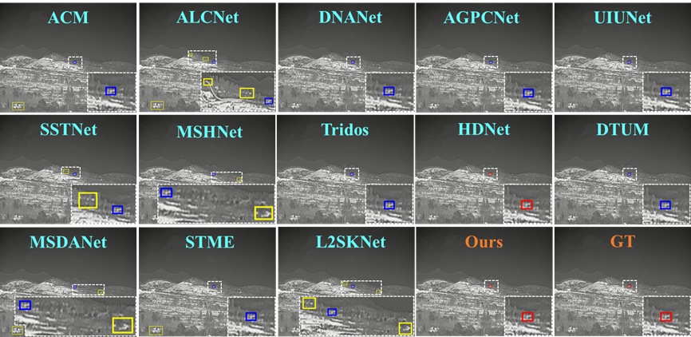
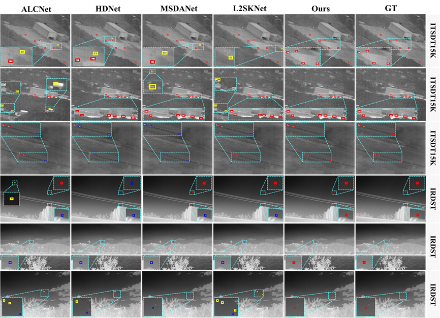

<div align="center">

## Motion Consistency-Guided Spatiotemporal Learning: A Robust Framework for Low-Altitude Infrared Object Detection


</div>

## Abstract

Low-altitude infrared object detection is a pivotal technology for airspace surveillance and wide-area monitoring. However, accurately locating dim targets remains a significant challenge, particularly when targets are embedded in complex dynamic backgrounds such as drifting clouds and swaying vegetation. While single-frame methods struggle with the inconspicuous spatial features of tiny objects, existing multi-frame approaches often fail to differentiate between the ordered motion patterns of potential targets and the random fluctuations of environmental clutter, leading to false alarms. To address this limitation, this article proposes a novel Motion Consistency-Guided Fusion Network (MCFNet). The key insight of our approach is that motion consistency serves as the critical physical cue for separating targets from cluttered backgrounds. Specifically, we first construct a bio-inspired motion perception module that incorporates fractional-order temporal integration to model the signal accumulation and memory effect of moving objects. To distinguish targets from dynamic clutter, we introduce a motion consistency encoding module that explicitly encodes motion directionality and trajectory coherence using dynamic directional filters. Furthermore, we implement a consistency-aware cross-attention mechanism that actively retrieves and reinforces spatially aligned features based on motion reliability. Comprehensive experiments on the Anti-UAV410, ITSDT-15K, and IRDST benchmarks demonstrate that our method outperforms state-of-the-art approaches, achieving a superior AP50 of 82.59% on the dynamic Anti-UAV410 dataset and a gain of 11.43% on the IRDST benchmark. Moreover, the model exhibits exceptional robustness in complex environments characterized by intense clutter and scale variations. 

## MCFNet Framework

<div align="center">

</div>

## Visualization

<div align="center">

Qualitative comparison of detection results on the Anti-UAV410 dataset.</div>


<div align="center">

Qualitative comparison on ITSDT-15K and IRDST datasets.</div>


## Code Structure

The project is organized as follows:
```text
MCFNet/
├── data/
│   ├── dataloader_for_AntiUAV410.py 
│   ├── dataloader_for_IRDST.py       
│   ├── dataloader_for_ITSDT15K.py
│   └── ...
├── model/                        
│   ├── nets/
│   └── ...
├── utils/
│   ├── callbacks.py                  
│   ├── utils.py  
│   └── ...
├── model_data/
│   ├── classes.txt 
│   └── ...                  
├── train_AntiUAV410.py  
├── train_IRDST.py
├── train_ITSDT15K.py
├── test.py  
└── README.md
```

## Environment

The current branch has been tested on a workstation equipped with a **single NVIDIA RTX 6000 GPU**.

* [Python==3.11.13](https://www.python.org/)
* [PyTorch==2.8.0](https://pytorch.org/)
* [CUDA==12.9](https://developer.nvidia.com/cuda-toolkit)
* [NumPy==2.2.6](https://numpy.org/)
* [Pillow==11.3.0](https://www.google.com/search?q=https://python-pillow.org/)
* [SciPy==1.16.2](https://scipy.org/)
* [tqdm==4.67.1](https://github.com/tqdm/tqdm)
* [Matplotlib==3.10.7](https://matplotlib.org/)

## Dataset Preparation

We utilize three major benchmarks: **Anti-UAV410**, **ITSDT-15K**, and **IRDST**.

Please organize the dataset structure as follows:

```text
data/
├── Anti-UAV410/
│   ├── train/
│   │   ├── new37_train-new/
│   │   │   ├── 000001.jpg
│   │   │   ├── 000014.jpg
│   │   │   └── ...
│   │   └── 3700000000002_085420_3/
│   │       ├── 000005.jpg
│   │       ├── 000006.jpg
│   │       └── ...
│   ├── val/
│   ├── test/
│   ├── train_AntiUAV410.txt
│   ├── val_AntiUAV410.txt
│   └── test_AntiUAV410.txt
├── ITSDT-15K/
│   └── images/
│   │   ├── 1/
│   │   │   ├── 1.bmp
│   │   │   ├── 2.bmp
│   │   │   └── ...
│   │   ├── 3/
│   │   │   ├── 8.bmp
│   │   │   ├── 9.bmp
│   │   │   └── ...
│   │   └── 83/
│   │       ├── 8.bmp
│   │       ├── 9.bmp
│   │       └── ...
│   ├── train_ITSDT15K.txt
│   └── test_ITSDT15K.txt
└── IRDST/
│   └── images/
│   │   ├── 2/
│   │   │   ├── 1.bmp
│   │   │   ├── 2.bmp
│   │   │   └── ...
│   │   ├── 6/
│   │   │   ├── 8.bmp
│   │   │   ├── 9.bmp
│   │   │   └── ...
│   │   └── 86/
│   │       ├── 32.bmp
│   │       ├── 33.bmp
│   │       └── ...
│   ├── train_IRDST.txt
│   └── test_IRDST.txt
```


## Installation

**Step 1.** Create a conda environment and activate it.

```bash
conda create -n mcfnet python=3.11.13
conda activate mcfnet
```

**Step 2.** Install the requirements.

```bash
# Install PyTorch (Compatible with CUDA 12.9)
pip install torch==2.8.0 torchvision torchaudio --index-url https://download.pytorch.org/whl/cu121

# Install other dependencies
pip install numpy pillow scipy tqdm matplotlib
```

## Usage

### Configuration

Before training, you **must** modify the configuration paths in the corresponding training script:

1. **Classes Path:**

```python
classes_path = '/ssd/data/model_data/classes.txt' 
```

2. **Data Paths:** Update `DATA_PATH` and annotation paths to point to your local dataset location.

**Example for Anti-UAV410:**

```python
DATA_PATH = "/ssd/data/Anti-UAV410/"
train_annotation_path = "/ssd/data/Anti-UAV410/train_AntiUAV410.txt"
val_annotation_path = "/ssd/data/Anti-UAV410/test_AntiUAV410.txt"
```

*(Note: Apply similar updates to `train_IRDST.py` and `train_ITSDT15K.py` using their respective dataset paths.)*

### Training

**Single GPU Training:**
To train the model on the Anti-UAV410 dataset:

```bash
# Set GPU ID and run
CUDA_VISIBLE_DEVICES=0 python train_AntiUAV410.py
```

To train on other datasets, run the corresponding script:

```bash
CUDA_VISIBLE_DEVICES=0 python train_IRDST.py
# or
CUDA_VISIBLE_DEVICES=0 python train_ITSDT15K.py
```

**Distributed Training (DDP):**
The script supports distributed training (Ubuntu/Linux only).

```bash
CUDA_VISIBLE_DEVICES=0,1 python -m torch.distributed.launch --nproc_per_node=2 train_AntiUAV410.py
```

## Citation

If you find this work helpful, please consider citing:

```bibtex
@article{MCFNet2026,
  title={Motion Consistency-Guided Spatiotemporal Learning: A Robust Framework for Low-Altitude Infrared Object Detection},
  author={Zhong, Leiyang and Yan, Liyue and Qin, Tian and Wu, Mengying and Zhang, Dejin and Li, Qingquan and He, Li},
  journal={Submitted to ISPRS Journal of Photogrammetry and Remote Sensing},
  year={2026}
}
```

## Acknowledgment

We thank the authors of [STME](https://github.com/UESTC-nnLab/STME) and [SSTNet](https://github.com/UESTC-nnLab/SSTNet) for their excellent open-source work, which provided valuable inspiration and references for this project. We also thank the authors of the [Anti-UAV410](), [IRDST](), and [ITSDT-15K]() datasets for providing the benchmarks.

## License

MIT License.
